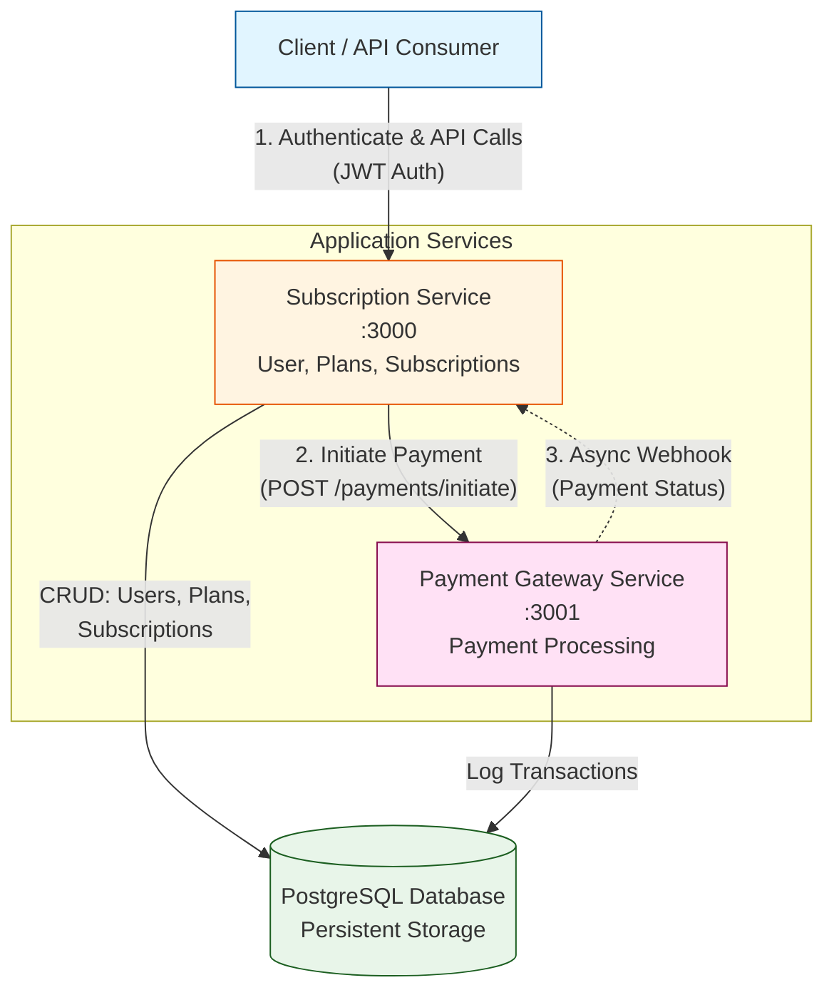
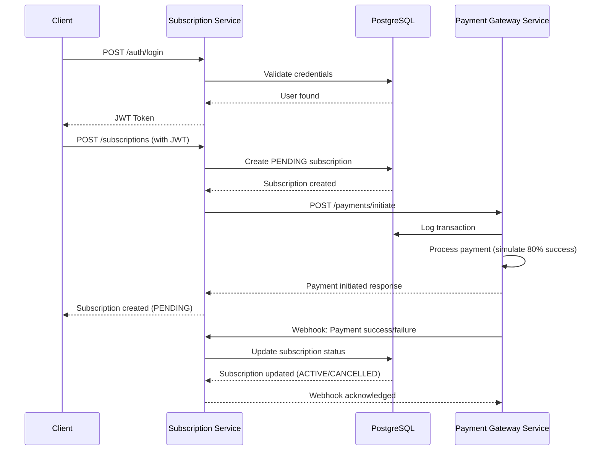

# Subscription Billing Microservices System

A microservices-based subscription billing system built with NestJS, featuring a User & Subscription Management Service and a Simulated Payment Gateway Service.

## Architecture



## Features

### Subscription Service
- **JWT Authentication** - Secure API access
- **User Management** - CRUD operations for users
- **Plan Management** - Create and manage subscription plans
- **Subscription Management** - Full lifecycle with upgrade/downgrade/cancel
- **Webhook Handler** - Receives payment status updates from payment service

### Payment Gateway Service
- **Payment Simulation** - Random success/failure simulation (80% success rate)
- **Webhook Delivery** - Async webhook delivery with retry logic (3 attempts)
- **Transaction Logging** - All payment attempts are logged to database

## Tech Stack

- **Framework**: NestJS
- **Database**: PostgreSQL with TypeORM
- **Authentication**: JWT
- **API Documentation**: Swagger/OpenAPI
- **Containerization**: Docker & Docker Compose

## Prerequisites

- Docker and Docker Compose installed
- Git installed

## Environment Variables

This project uses a multi-level environment configuration:
- **Root `.env.example`**: Contains shared defaults for Docker Compose
- **Service `.env.example`**: Service-specific overrides for local development

### For Docker (Recommended)
```bash
# Copy root environment file
cp .env.example .env
# Edit .env with your settings (optional)
```

The root `.env` file contains prefixed variables (e.g., `SUBSCRIPTION_DATABASE_URL`, `PAYMENT_DATABASE_URL`) that Docker Compose uses to configure each service.

### For Local Development (Without Docker)

Each service can use both root and local `.env` files. Local files override root defaults:

#### Subscription Service
```bash
cd subscription-service
cp .env.example .env
# Edit .env with your local settings
```

#### Payment Gateway Service
```bash
cd payment-gateway-service
cp .env.example .env
# Edit .env with your local settings
```

**How it works**: Services load `.env` from their directory first (local overrides), then fall back to the root `.env` (shared defaults). This prevents configuration drift between Docker and local development.

## Quick Start

### 1. Clone and Setup

```bash
git clone <repository-url>
cd sub-billing
```

### 2. Start Services

```bash
# Copy environment variables (first time only)
cp .env.docker .env

# Start services
docker-compose up --build
```

Note: You can edit `.env` to customize database credentials, ports, and secrets.

This command will:
- Build both service Docker images
- Start PostgreSQL database
- Auto-synchronize TypeORM schemas (Docker sets NODE_ENV=test)
- Start both services

Services will be available at:
- Subscription Service: http://localhost:3000
- Payment Gateway Service: http://localhost:3001
- Swagger UI (Subscription): http://localhost:3000/api
- Swagger UI (Payment): http://localhost:3001/api

### 3. Access the APIs

Open your browser to view Swagger documentation:
- http://localhost:3000/api (Subscription Service)
- http://localhost:3001/api (Payment Gateway Service)

## Test Credentials

The database is automatically seeded with test data:
- **User 1**: `user1@example.com` / `password123`
- **User 2**: `user2@example.com` / `password123`
- **Plans**: Basic Plan ($9.99/month), Pro Plan ($29.99/month), Premium Plan ($99.99/year)

## API Flow Walkthrough

### Complete Subscription Flow

The following sequence diagram illustrates the complete subscription creation flow:



#### 1. Login to get JWT token

```bash
curl -X POST http://localhost:3000/auth/login \
  -H "Content-Type: application/json" \
  -d '{
    "email": "user1@example.com",
    "password": "password123"
  }'
```

Response:
```json
{
  "access_token": "eyJhbGciOiJIUzI1NiIsInR5cCI6IkpXVCJ9..."
}
```

#### 2. Create a Subscription

```bash
curl -X POST http://localhost:3000/subscriptions \
  -H "Content-Type: application/json" \
  -H "Authorization: Bearer YOUR_JWT_TOKEN" \
  -d '{
    "planId": "basic-plan"
  }'
```

This will:
1. Create a PENDING subscription
2. Initiate payment request to payment gateway
3. Payment gateway simulates payment (80% success rate)
4. Payment gateway sends webhook to subscription service
5. Subscription status updated (ACTIVE or CANCELLED)

#### 3. Check Subscription Status

```bash
curl http://localhost:3000/subscriptions/{subscription_id} \
  -H "Authorization: Bearer YOUR_JWT_TOKEN"
```

#### 4. Upgrade Subscription

```bash
curl -X PATCH http://localhost:3000/subscriptions/{subscription_id}/upgrade \
  -H "Content-Type: application/json" \
  -H "Authorization: Bearer YOUR_JWT_TOKEN" \
  -d '{
    "planId": "pro-plan"
  }'
```

#### 5. Cancel Subscription

```bash
curl -X DELETE http://localhost:3000/subscriptions/{subscription_id} \
  -H "Authorization: Bearer YOUR_JWT_TOKEN"
```

## API Endpoints

### Subscription Service

#### Authentication
- `POST /auth/login` - Login and get JWT token

#### Users
- `GET /users` - Get all users
- `GET /users/:id` - Get user by ID
- `POST /users` - Create user
- `PATCH /users/:id` - Update user
- `DELETE /users/:id` - Delete user

#### Plans
- `GET /plans` - Get all plans (supports `?activeOnly=true`)
- `GET /plans/:id` - Get plan by ID
- `POST /plans` - Create plan
- `PATCH /plans/:id` - Update plan
- `DELETE /plans/:id` - Delete plan

#### Subscriptions
- `POST /subscriptions` - Create subscription
- `GET /subscriptions` - Get all subscriptions (supports `?userId=xxx`)
- `GET /subscriptions/:id` - Get subscription by ID
- `PATCH /subscriptions/:id/upgrade` - Upgrade subscription
- `PATCH /subscriptions/:id/downgrade` - Downgrade subscription
- `DELETE /subscriptions/:id` - Cancel subscription

#### Webhooks
- `POST /webhooks/payment` - Receive payment webhook from payment gateway

### Payment Gateway Service

#### Payments
- `POST /payments/initiate` - Initiate payment
- `GET /payments` - Get all payment transactions
- `GET /payments/:id` - Get payment transaction by ID

## Sample Payloads

### Create Subscription

Request to Payment Gateway:
```json
{
  "subscriptionId": "uuid-here",
  "amount": 29.99,
  "webhookUrl": "http://subscription-service:3000/webhooks/payment"
}
```

Webhook sent to Subscription Service:
```json
{
  "subscriptionId": "uuid-here",
  "paymentId": "payment-uuid",
  "success": true
}
```

## Deployment

### Staging/Production Considerations

1. **Environment Variables**
   - Change `JWT_SECRET` to a strong secret
   - Configure proper database credentials
   - Update service URLs for service-to-service communication

2. **Database Schema Management**
   - In Docker, schemas are auto-synchronized by TypeORM because `NODE_ENV=test`
   - For staging/production, disable `synchronize` and use proper TypeORM migrations
   - Recommendation: add TypeORM migrations before deploying to non-test environments

3. **Scaling**
   - Each service is stateless and can be horizontally scaled
   - Use load balancer for multiple instances
   - Consider using message queue (RabbitMQ, Kafka) for webhooks instead of direct HTTP calls

4. **Security**
   - Implement webhook signature verification
   - Use HTTPS in production
   - Set up rate limiting and DDoS protection
   - Regular security audits

5. **Monitoring**
   - Add Prometheus metrics
   - Set up logging with ELK stack or similar
   - Configure health check endpoints
   - Set up alerting for critical failures

## Development

### Running Locally (Without Docker)

```bash
# Start PostgreSQL
docker run -d -p 5432:5432 -e POSTGRES_PASSWORD=postgres postgres:15-alpine

# Subscription Service
cd subscription-service
npm install
npm run dev

# Payment Gateway Service (another terminal)
cd payment-gateway-service
npm install
npm run dev
```

### Running Tests

```bash
# Subscription Service
cd subscription-service
npm test

# Payment Gateway Service
cd payment-gateway-service
npm test
```

### E2E Tests

End-to-end API tests run the full flow described above (login → create plan → create subscription → webhook → status check) against real containers started via docker-compose. The tests create all required data via API; no seeds are required.

Setup:
```bash
# Copy sample test environment to project root as .env.test
cp e2e/env.test.sample .env.test
```

Run:
```bash
npm run test:e2e
```

This will:
- Build and start services using `.env.test`
- Wait for `http://localhost:3000` and `http://localhost:3001`
- Execute Jest specs in `e2e/`
- Tear down all containers afterward

## Time Spent & Assumptions

### Time Spent
- Project setup and configuration: 2 hours
- Database schema design: 1 hour
- Subscription service implementation: 4 hours
- Payment gateway implementation: 3 hours
- Webhook integration: 2 hours
- Docker setup and documentation: 2 hours
- **Total: ~14 hours**

### Assumptions & Trade-offs

1. **Webhook Retry Logic**: Implemented basic retry with exponential backoff. In production, consider using a message queue for more reliable delivery.

2. **Payment Simulation**: Simple random success/failure (80% success). Real implementation would integrate with payment providers like Stripe, PayPal.

3. **Prorated Calculations**: Simplified proration for upgrades. Full implementation would consider billing cycle dates and partial periods.

4. **Single Database**: Both services use same PostgreSQL instance for simplicity. Production should use separate databases for true isolation.

5. **No Webhook Signature Verification**: Added placeholders for security but not fully implemented. Production should include HMAC signature verification.

6. **No Rate Limiting**: Added throttler but using default values. Production should configure appropriate limits.

7. **Error Handling**: Basic error handling implemented. Production needs comprehensive error tracking and logging.

8. **Testing**: Basic structure provided but tests need to be written. Unit tests for business logic and integration tests for API flows are needed.

## Troubleshooting

### Services won't start
- Ensure ports 3000, 3001, and 5432 are not in use
- Check Docker logs: `docker-compose logs`

### Database connection errors
- Wait for PostgreSQL to be healthy: `docker-compose ps`
- Check database URL in environment variables

### Webhook not received
- Check payment service logs: `docker-compose logs payment-gateway-service`
- Verify network connectivity between services
- Check webhook URL is correct

## License

MIT

