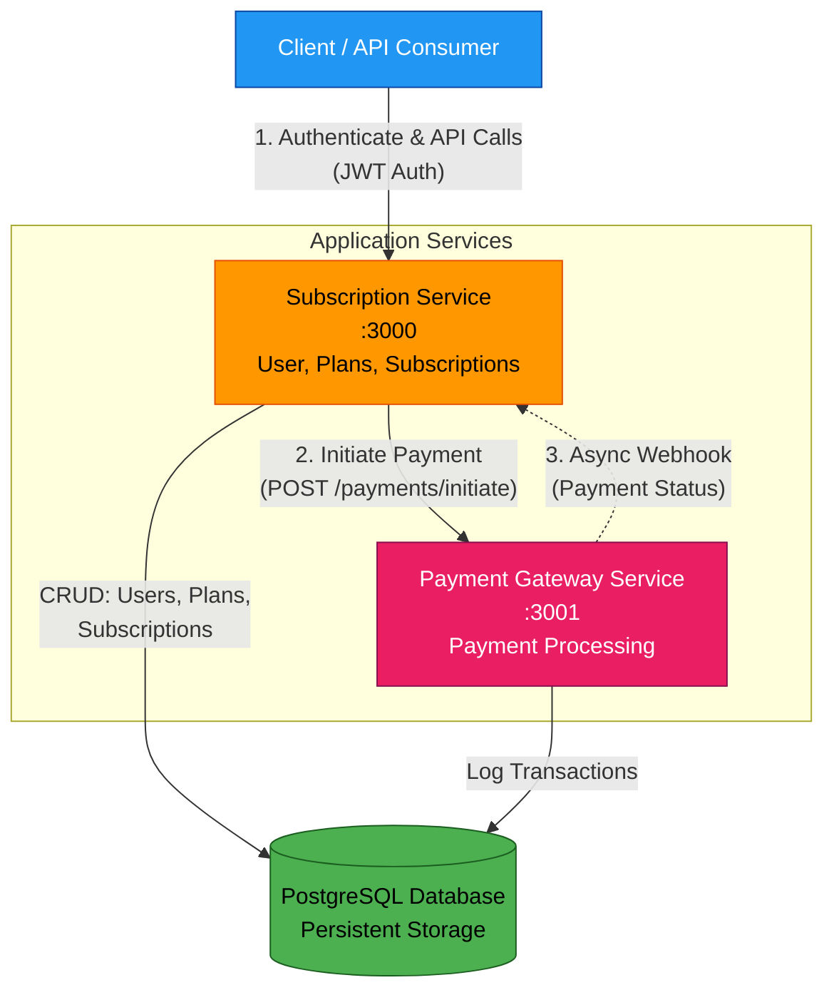
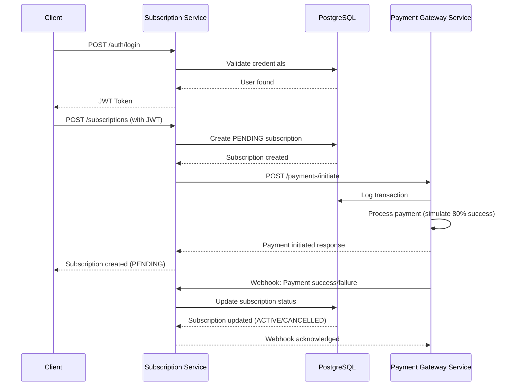

# Subscription Billing Microservices System

A microservices-based subscription billing system built with NestJS, featuring a User & Subscription Management Service and a Simulated Payment Gateway Service.

## Architecture



## Features

### Subscription Service
- **JWT Authentication** - Secure API access
- **User Management** - CRUD operations for users
- **Plan Management** - Create and manage subscription plans
- **Subscription Management** - Full lifecycle with upgrade/downgrade/cancel
- **Webhook Handler** - Receives payment status updates from payment service

### Payment Gateway Service
- **Payment Simulation** - Random success/failure simulation (80% success rate)
- **Webhook Delivery** - Async webhook delivery with retry logic (3 attempts)
- **Transaction Logging** - All payment attempts are logged to database

## Tech Stack

- **Framework**: NestJS
- **Database**: PostgreSQL with Prisma
- **Authentication**: JWT
- **API Documentation**: Swagger/OpenAPI
- **Containerization**: Docker & Docker Compose

## Prerequisites

- Docker and Docker Compose installed
- Git installed

## Environment Variables

Docker Compose provides sane defaults, so no `.env` file is required to start the stack. You can override any value via a root `.env` file or shell environment variables.

For examples of values used in tests, see `e2e/env.test.sample`.


## Quick Start

### 1. Clone and Setup

```bash
git clone <repository-url>
cd subscription-billing
```

### 2. Start Services

```bash
# Start services
docker-compose up --build
```

Note: You can edit `.env` to customize database credentials, ports, and secrets.

This command will:
- Build both service Docker images
- Start PostgreSQL database
- Start both services
- **Automatically sync database schema** using `prisma db push` (development only)
- **Automatically seed the subscription service** with sample users and plans (if seed script exists)

Services will be available at:
- Subscription Service: http://localhost:3000
- Payment Gateway Service: http://localhost:3001
- Swagger UI (Subscription): http://localhost:3000/api
- Swagger UI (Payment): http://localhost:3001/api

## Test Credentials

**Note**: When using `docker-compose up`, the subscription service automatically seeds the database with sample users and plans during startup. The following is only needed if you're running services manually or want to re-seed:

```bash
# From the repository root
cd subscription-service

# If using migrations (instead of db push), deploy committed migrations first
# npm run prisma:migrate:deploy

# Run the seed script defined in prisma/seed.ts
npx prisma db seed
```

After seeding:
- **User**: `seed.user@example.com` / `Password123!`
- **Plans**:
  - `fixed-basic` - Basic Plan ($9.99/month)
  - `fixed-pro` - Pro Plan ($29.99/month)

## API Flow Walkthrough

> **💡 Tip:** For interactive testing, use the REST Client file (`e2e/full-flow.http`) with VSCode's REST Client extension. See the [Manual API Testing with REST Client](#manual-api-testing-with-rest-client) section for detailed instructions.

### Complete Subscription Flow

The following sequence diagram illustrates the complete subscription creation flow:



#### 1. Login to get JWT token

```bash
curl -X POST http://localhost:3000/auth/login \
  -H "Content-Type: application/json" \
  -d '{
    "email": "seed.user@example.com",
    "password": "Password123!"
  }'
```

Response:
```json
{
  "access_token": "eyJhbGciOiJIUzI1NiIsInR5cCI6IkpXVCJ9..."
}
```

#### 2. Create a Subscription

```bash
curl -X POST http://localhost:3000/subscriptions \
  -H "Content-Type: application/json" \
  -H "Authorization: Bearer YOUR_JWT_TOKEN" \
  -d '{
    "planId": "fixed-basic"
  }'
```

This will:
1. Create a PENDING subscription
2. Initiate payment request to payment gateway
3. Payment gateway simulates payment (80% success rate)
4. Payment gateway sends webhook to subscription service
5. Subscription status updated (ACTIVE or CANCELLED)

**Note**: You must use a valid `planId` that exists in the database. The seeded plans are `fixed-basic` and `fixed-pro`. You can also create your own plans via the `/plans` endpoint.

#### 3. Check Subscription Status

```bash
curl http://localhost:3000/subscriptions/{subscription_id} \
  -H "Authorization: Bearer YOUR_JWT_TOKEN"
```

#### 4. Upgrade Subscription

```bash
curl -X PATCH http://localhost:3000/subscriptions/{subscription_id}/upgrade \
  -H "Content-Type: application/json" \
  -H "Authorization: Bearer YOUR_JWT_TOKEN" \
  -d '{
    "planId": "fixed-pro"
  }'
```

This will:
1. Validate that subscription is ACTIVE
2. Verify the new plan has a higher price than the current plan
3. Calculate prorated amount (difference between new and current plan prices)
4. Initiate payment request to payment gateway for the prorated amount
5. Payment gateway simulates payment (80% success rate)
6. Payment gateway sends webhook to subscription service
7. Subscription status updated via webhook (stays ACTIVE on success, or CANCELLED on failure)

**Note**: The subscription must be ACTIVE to upgrade. Only plans with a higher price than the current plan are allowed.

#### 5. Cancel Subscription

```bash
curl -X DELETE http://localhost:3000/subscriptions/{subscription_id} \
  -H "Authorization: Bearer YOUR_JWT_TOKEN"
```

## API Endpoints

### Subscription Service

#### Authentication
- `POST /auth/login` - Login and get JWT token

#### Users
- `GET /users` - Get all users
- `GET /users/:id` - Get user by ID
- `POST /users` - Create user
- `PATCH /users/:id` - Update user
- `DELETE /users/:id` - Delete user

#### Plans
- `GET /plans` - Get all plans (supports `?activeOnly=true`)
- `GET /plans/:id` - Get plan by ID
- `POST /plans` - Create plan
- `PATCH /plans/:id` - Update plan
- `DELETE /plans/:id` - Delete plan

#### Subscriptions
- `POST /subscriptions` - Create subscription
- `GET /subscriptions` - Get all subscriptions (supports `?userId=xxx`)
- `GET /subscriptions/:id` - Get subscription by ID
- `PATCH /subscriptions/:id/upgrade` - Upgrade subscription
- `PATCH /subscriptions/:id/downgrade` - Downgrade subscription
- `DELETE /subscriptions/:id` - Cancel subscription

#### Webhooks
- `POST /webhooks/payment` - Receive payment webhook from payment gateway

### Payment Gateway Service

#### Payments
- `POST /payments/initiate` - Initiate payment
- `GET /payments` - Get all payment transactions
- `GET /payments/:id` - Get payment transaction by ID

## Testing

### E2E Tests

End-to-end API tests run the full flow described above (login → create plan → create subscription → webhook → status check) against real containers started via docker-compose. The tests create all required data via API; no seeds are required.

**Setup:**
```bash
# Copy sample test environment to project root as .env.test
cp e2e/env.test.sample .env.test
```

**Run:**
```bash
npm run test:e2e
```

This will:
- Build and start services using `.env.test`
- Wait for `http://localhost:3000` and `http://localhost:3001`
- Execute Jest specs in `e2e/`
- Tear down all containers afterward

### Manual API Testing with REST Client

For interactive manual testing, you can use the REST Client file (`e2e/full-flow.http`) with VSCode's REST Client extension.

**Prerequisites:**
1. Install REST Client extension in VSCode (by Huachao Mao)
2. Start services: `docker-compose up`
3. Seeding is automatic when using docker-compose

**Usage:**
1. Open `e2e/full-flow.http` in VSCode
2. Run Step 1 (Login) → Copy `access_token` → Update `@token` variable
3. Run Step 3 (Create Subscription) → Copy subscription `id` → Update `@subscriptionId` variable
4. Continue with remaining steps

See the [API Flow Walkthrough](#api-flow-walkthrough) section for more details on the complete flow.

## Deployment

### Staging/Production Considerations

1. **Environment Variables**
   - Change `JWT_SECRET` to a strong secret
   - Configure proper database credentials
   - Update service URLs for service-to-service communication

2. **Database Schema Management**
   - **Development (via Docker Compose)**: Schema is automatically synced using `prisma db push` when services start. This is convenient for local development but does not maintain migration history.
   - **Development (manual)**: To create versioned migrations for development (from repo root):
     - `npm run prisma:migrate:subscription`
     - `npm run prisma:migrate:gateway`
   - **Staging/Production**: **MUST use `migrate deploy`** to apply committed migrations (from repo root):
     - `npm run prisma:migrate:deploy --workspace=subscription-service`
     - `npm run prisma:migrate:deploy --workspace=payment-gateway-service`
   - **Important**: In production, replace the `db push` commands in docker-compose with `migrate deploy` or handle migrations via CI/CD pipeline before starting services.

3. **Scaling**
   - Each service is stateless and can be horizontally scaled
   - Use load balancer for multiple instances
   - Consider using message queue (RabbitMQ, Kafka) for webhooks instead of direct HTTP calls

4. **Security**
   - Implement webhook signature verification
   - Use HTTPS in production
   - Set up rate limiting and DDoS protection
   - Regular security audits

5. **Monitoring**
   - Add Prometheus metrics
   - Set up logging with ELK stack or similar
   - Configure health check endpoints
   - Set up alerting for critical failures

## Time Spent & Assumptions

### Time Spent
- Project setup and initial configuration: 2 hours
- Database schema and services implementation: 5 hours
- Docker setup and documentation: 3 hours
- **Total: ~10 hours**

### Assumptions & Trade-offs

1. **Webhook Retry Logic**: Implemented basic retry with linear backoff (1s, 2s, 3s delays). In production, consider using a message queue for more reliable delivery.

2. **Payment Simulation**: Simple random success/failure (80% success). Real implementation would integrate with payment providers like Stripe, PayPal.

3. **Prorated Calculations**: Simplified proration for upgrades (simple price difference). Full implementation would consider billing cycle dates and partial periods.

4. **Single Database**: Both services use same PostgreSQL instance for simplicity. Production should use separate databases for true isolation.

5. **No Webhook Signature Verification**: Added placeholders for security but not fully implemented. Production should include signature verification.

6. **Rate Limiting**: Throttler configured with basic values (10 requests per 60 seconds). Production should configure appropriate limits based on expected load.

7. **Error Handling**: Basic error handling implemented with NestJS exceptions. Production needs comprehensive error tracking and logging.

8. **Testing**: Comprehensive unit tests are implemented for key business logic (35 tests in subscription-service, 11 tests in payment-gateway-service). E2E tests cover full API flows. Additional integration tests could be added for more complex scenarios.

